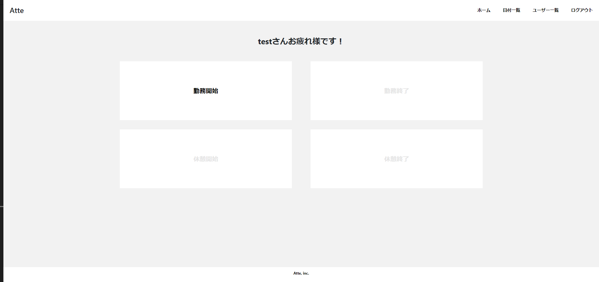
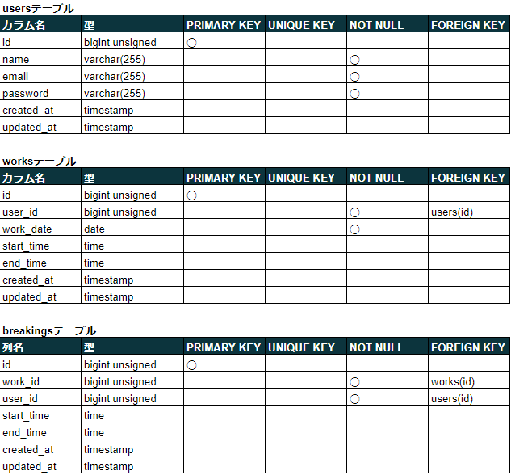
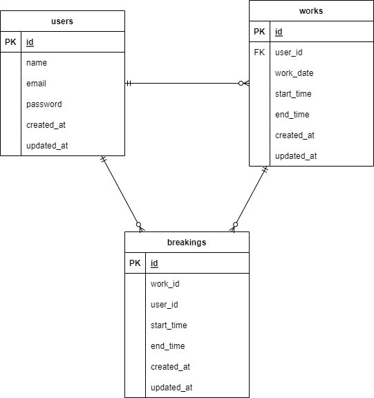

# Atte（アット）

## 概要説明
企業向け勤怠管理システム



## 作成した目的
人事評価のため

## アプリケーションURL
- 開発環境：http://localhost/
- phpMyAdmin:：http://localhost:8080/
- MailHog : http://localhost:8025/

- AWS : http://54.64.147.14/
- AWS MailHog : http://54.64.147.14:8025/

## 機能一覧
- 会員登録
- メール認証
- ログイン
- ログアウト
- 勤務開始
- 勤務終了
- 休憩開始
- 休憩終了
- 日付別勤怠情報取得
- ユーザー一覧
- ユーザー別勤怠情報取得

## 使用技術（実行環境）
- PHP 7.4.9
- Laravel 8.83.8
- MySQL 8.0.26

## テーブル設計


## ER図


## 環境構築
**Dockerビルド**
1. `git clone git@github.com:kohkikawarasaki/atte.git`
2. DockerDesktopアプリを立ち上げる
3. `docker-compose up -d --build`

**Laravel環境構築**
1. `docker-compose exec php bash`
2. `composer install`
3. 「.env.example」ファイルを 「.env」ファイルに命名を変更。または、新しく.envファイルを作成
4. .envに以下の環境変数を追加
``` text
DB_CONNECTION=mysql
DB_HOST=mysql
DB_PORT=3306
DB_DATABASE=laravel_db
DB_USERNAME=laravel_user
DB_PASSWORD=laravel_pass
```
5. アプリケーションキーの作成
``` bash
php artisan key:generate
```

6. マイグレーションの実行
``` bash
php artisan migrate
```

7. シーディングの実行
``` bash
php artisan db:seed
```

## テストユーザー
email:test@test.com
password:password

## テスト環境
1. キャッシュの削除
``` bash
php artisan config:cache
```

2. テスト用DBの作成
``` bash
mysql -u root
create database demo_test;
```

3. アプリケーションキーの作成
``` bash
php artisan key:generate --env=testing
```
4. マイグレーションの実行
``` bash
php artisan key:generate --env=testing
```

## メール認証機能の確認手順
1. 会員登録ページにて任意のユーザーを作成
2. MailHogにアクセス ※アプリケーションURL参照
3. 入力したメールアドレス宛に届いているメールを確認し、認証を行う
